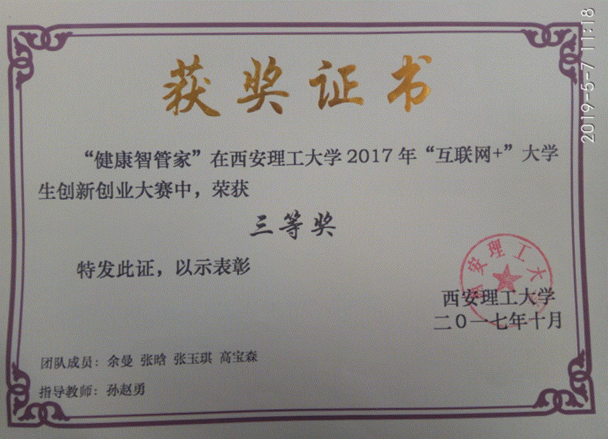
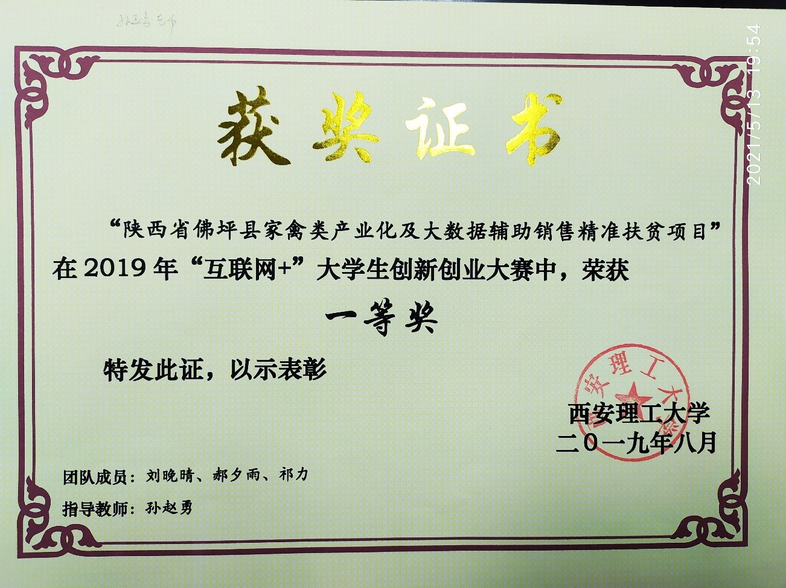
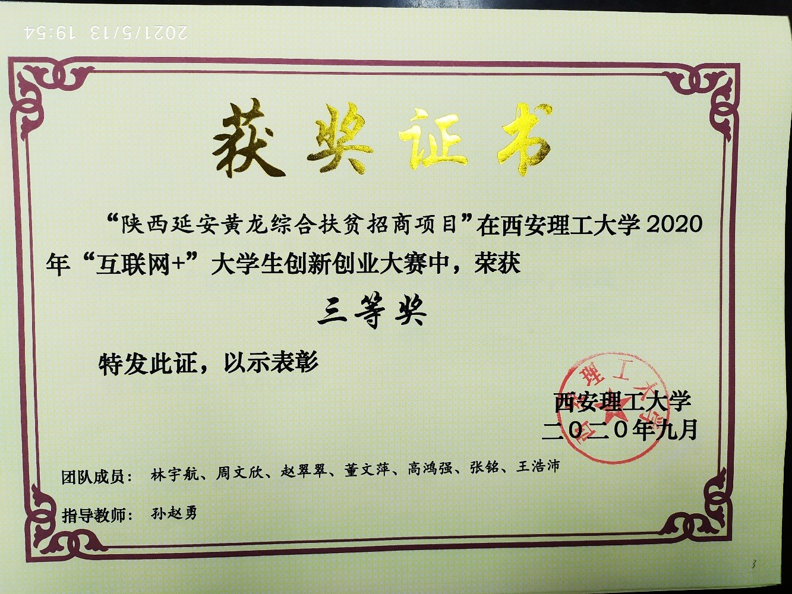
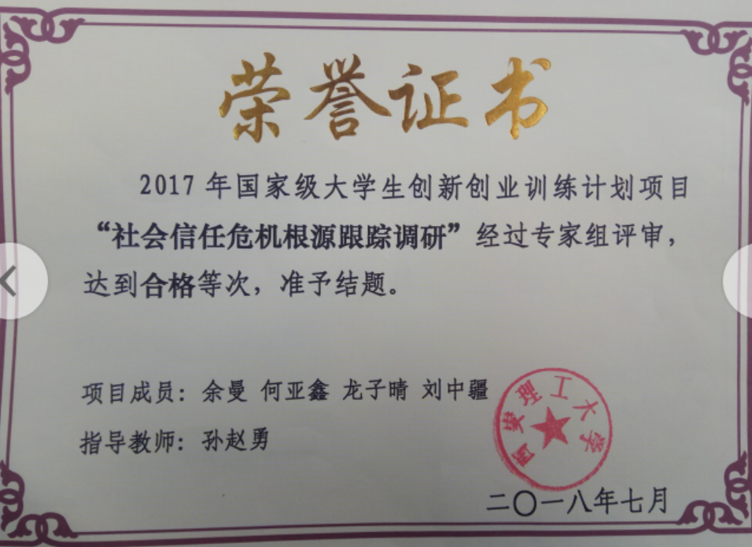
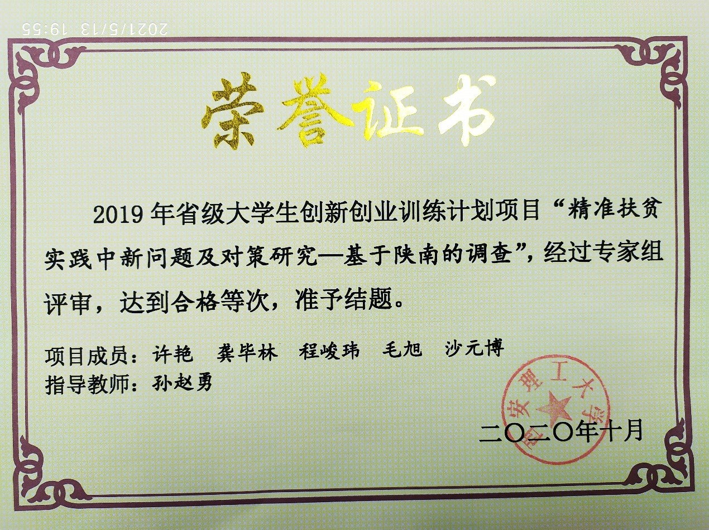

## 德才并重、铸魂育人：专业教学中的精准思政教学改革与实践

完成单位：西安理工大学经济与管理学院

### 教学成果简介

  针对党和国家事业发展对德才兼备人才的迫切需求。秉承“立德树人、德才并重”的教育理念，充分发挥我校国家级特色专业的优势，系统构建了专业教育与思想政治教育有机融合的经管专业的人才培养体系，成功践行了精准思政教学改革和实践。
  
  ①确立价值塑造、知识传授与能力培养相融合的建设理念。培养既有正确世界观、人生观和价值观，又有扎实专业基础和创新精神的经管专业人才为目标，在育人过程中贯彻德才并重、铸魂育人的人才培养理念。
  
  ②设计了专业教学与思政教育相融合的教学体系。研究论证了思政教育与经管学科各专业教学的无缝对接、有机互融的方式。基于学生身心发展特点、学科课程特点，对教学目标、教学内容、教学方法和案例进行系统设计，实施精准思想政治教育。
  
  ③构建了思政课程教师参与专业教学的协同育人模式。充分发挥思政教育与专业教育的协同效应，思政课程教师深度参与专业教学的各个环节，协同发挥课程体系教育功能，协同强化管理育人机制，将思想政治教育融入到学生职业素质培养的全过程。
  
  ④孵化大量体现精准思政内涵的教改成果。完成省级精品课程《国际金融实务（双语课）》和《ERP 沙盘模拟》，承担的线上 MOOC 《计量经济学》和省级创新创业类精品课程《创新方法论》。在 MOOC 教学中注重价值观融入，实现知识传授和价值引领的有机统一。出版了专业教材《投资学》、《计量经济学》，教材内容重视价值观、人生观和世界观与专业知识的结合。
  
  ⑤培养了一批具备爱国情怀和责任担当的专业人才。近年来，学生关注社会热点问题，社会责任感和实践创新能力极大提高，在全国大形势挑战杯、大学生创新创业大赛、互联网+创新创业项目获得大量奖项。

### 教学成果曾获奖励情况
- 2020年，“社会主义核心价值观”融入经管类专业教育的探索与实践，获陕西省教学成果奖“二等奖”
 ！
- 2013年，基于实践教学创新的管理类应用型本科人才培养模式研究与实践，获陕西省教学成果奖“二等奖”
！
- 2019年，“社会核心价值观教育”和“专业素质培养”相融合的经管类本科教学体系改革探索与实践，获西安理工大学“特等奖”
！
-2019年，西安理工大学“树魂立根 课程育人”讲课比赛，获“三等奖”
### 比赛获奖
2017年，“互联网+”大学生创新创业大赛中，项目“健康智管家”，获“三等奖”

2019年，“互联网+”大学生创新创业大赛中，项目“陕西佛坪县家禽类产业化及大数据辅助销售精准扶贫项目”，获“一等奖”

2020年，“互联网+”大学生创新创业大赛中，项目“陕西延安黄龙综合扶贫招商项目”，获“三等奖”

2013.6.7 第九届西安高新“挑战杯”陕西省大学生课外学术科技作品竞赛， 作
为第一指导老师指导学生 “无偿献血“信任危机”产生原因的调查报告”
获陕西省“特等奖”

2013.10.14 第十三届“挑战杯”全国大学生课外学术科技作品竞赛， 作为第二
指导教师 指导学生“医患关系紧张原因的研究报告” 获国家“三等奖”
### 指导本科生创新创业竞赛
2017年，国家级大学生创新创业训练计划项目“社会信任危机根源跟踪调研”，结题

2019年，省级大学生创新创业训练计划项目“精准扶贫实践中新问题及对策研究——基于陕南的调查”，结题

### 完成的教改项目
2018年12-2020年12月，经济学类课程教学中的实验设计

2018年5-2019年5月， 西安理工大学“课程思政”示范课程“微观经济学”

2018年西安理工大学在线开放课程建设项目“计量经济学”

